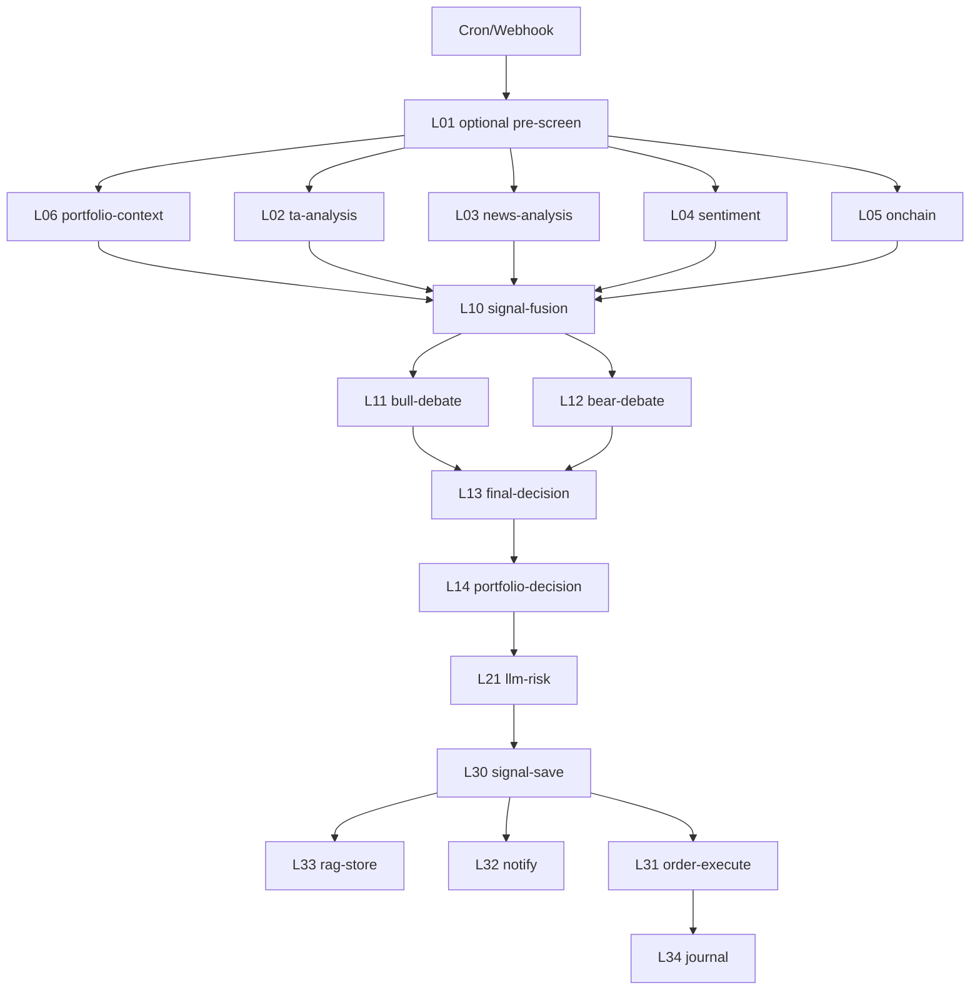

# 루나팀 n8n 워크플로우 초안

## 목적

루나팀의 현재 Node.js 노드 파이프라인을 n8n 워크플로우로 옮길 때,
바로 참조할 수 있는 최소 실행 설계 문서다.

핵심 원칙:

- 오케스트레이션은 `n8n`
- 상태의 기준 원장은 `PostgreSQL`
- 비정형 컨텍스트와 중간 기억은 `RAG`
- 노드 간 직접 결합보다 `session_id` 기반 간접 연결 우선

## 현재 구현된 노드

### 수집

- `L01` pre-screen
- `L02` ta-analysis
- `L03` news-analysis
- `L04` sentiment
- `L05` onchain
- `L06` portfolio-context

### 판단

- `L10` signal-fusion
- `L11` bull-debate
- `L12` bear-debate
- `L13` final-decision
- `L14` portfolio-decision

### 리스크

- `L21` llm-risk

### 실행

- `L30` signal-save
- `L31` order-execute
- `L32` notify
- `L33` rag-store
- `L34` journal

## 아직 미구현 노드

- `L20` hard-rules
- `L22` dynamic-tpsl
- `L23` kelly-sizing

현재는 이 역할이 [nemesis.js](/Users/alexlee/projects/ai-agent-system/bots/investment/team/nemesis.js) 내부에 포함되어 있다.

## 현재 코드 진입점

- 단일 노드 실행기: [run-pipeline-node.js](/Users/alexlee/projects/ai-agent-system/bots/investment/scripts/run-pipeline-node.js)
- 수집 러너: [pipeline-market-runner.js](/Users/alexlee/projects/ai-agent-system/bots/investment/shared/pipeline-market-runner.js)
- 판단/실행 브리지: [pipeline-decision-runner.js](/Users/alexlee/projects/ai-agent-system/bots/investment/shared/pipeline-decision-runner.js)
- 세션 메타 저장: [pipeline-db.js](/Users/alexlee/projects/ai-agent-system/bots/investment/shared/pipeline-db.js)

## n8n 워크플로우 분리 기준

### 1. crypto-cycle

트리거:

- 30분 cron
- BTC 급등락 웹훅

플로우:

### 2. domestic-cycle

트리거:

- 30분 cron

분기:

- 장중: 실거래 파이프라인
- 장외: 연구 모드

장중 플로우:

- `L06 -> L02/L03/L04 -> L10 -> L11/L12 -> L13 -> L14 -> L21 -> L30 -> L33 -> L32 -> L31 -> L34`

장외 플로우:

- `L06 -> L02/L03/L04`
- 이후 watchlist 저장

### 3. overseas-cycle

트리거:

- 30분 cron

분기:

- 미국 장중: 실거래 파이프라인
- 장외: 연구 모드

플로우는 국내장과 동일하고 거래소만 `kis_overseas`

## n8n 노드 타입 매핑

### 추천 n8n 구성

- `Cron`
  - 시장별 주기 실행
- `Webhook`
  - 긴급 트리거
- `Code`
  - 파라미터 조립, session context 유지
- `Execute Command`
  - `node bots/investment/scripts/run-pipeline-node.js ...`
- `IF`
  - 장중/장외 분기
  - HOLD/APPROVE/REJECT 분기
- `Merge`
  - 병렬 수집/토론 결과 합류
- `Wait`
  - 재시도 전 backoff

### 추천 호출 방식

1. 초기에는 `Execute Command` 방식
2. 안정화 후 HTTP API 래퍼 추가
3. 이후 n8n에서 HTTP Request로 교체

이유:

- 현재 노드 실행기는 이미 CLI로 준비됨
- API 서버를 새로 만들지 않아도 바로 연결 가능

## session_id 규칙

n8n은 한 워크플로우 실행마다 하나의 `session_id`를 유지해야 한다.

필수 전달 값:

- `session_id`
- `market`
- `symbol`
- `trigger_type`
- `trigger_ref`

권장 metadata:

- `workflow_name`
- `workflow_run_id`
- `market_script`
- `research_only`
- `source`

## 실패 처리 규칙

### 노드 실패

- 수집 노드 실패는 다른 수집 노드를 막지 않음
- `L02` 실패 시에도 `L03/L04/L05`로 계속 진행
- `L11/L12` 실패 시 `L13`은 debate 없이 진행 가능

### 재시도

- 수집 노드: 최대 1회 재시도
- LLM 노드: rate limit이면 backoff 후 1회 재시도
- 실행 노드: 자동 재시도 금지

### 중단 조건

- `L30` 실패: 이후 실행 노드 중단
- `L31` 실패: `L34`는 상태 확인만 수행

## 운영 가시성

n8n 대시보드에서 반드시 보일 항목:

- 시장별 성공/실패 수
- 평균 cycle duration
- 노드별 실패율
- 승인 수 / 거부 수 / 실행 수
- 실거래 / PAPER 비율

## 즉시 구현 권장 순서

1. `domestic research-only` 워크플로우
2. `overseas research-only` 워크플로우
3. `crypto collect-only` 워크플로우
4. `domestic full cycle`
5. `overseas full cycle`
6. `crypto full cycle`

이 순서를 추천하는 이유:

- 연구 모드는 실거래 리스크가 없음
- stock 장외 연구 모드는 이미 현재 코드에서 안정적으로 검증됨
- crypto는 24/7라서 n8n 이관 전 운영 창구를 더 조심해서 옮기는 편이 안전함

## 현시점 권장 결정

- 루나팀은 `코드 노드화 1차`가 거의 완료된 상태로 본다
- 다음 단계는 세부 노드 추가보다 `n8n orchestration 초안 구현`이 맞다
- 특히 첫 적용은 `연구 모드`부터 시작하는 것이 가장 안전하다
