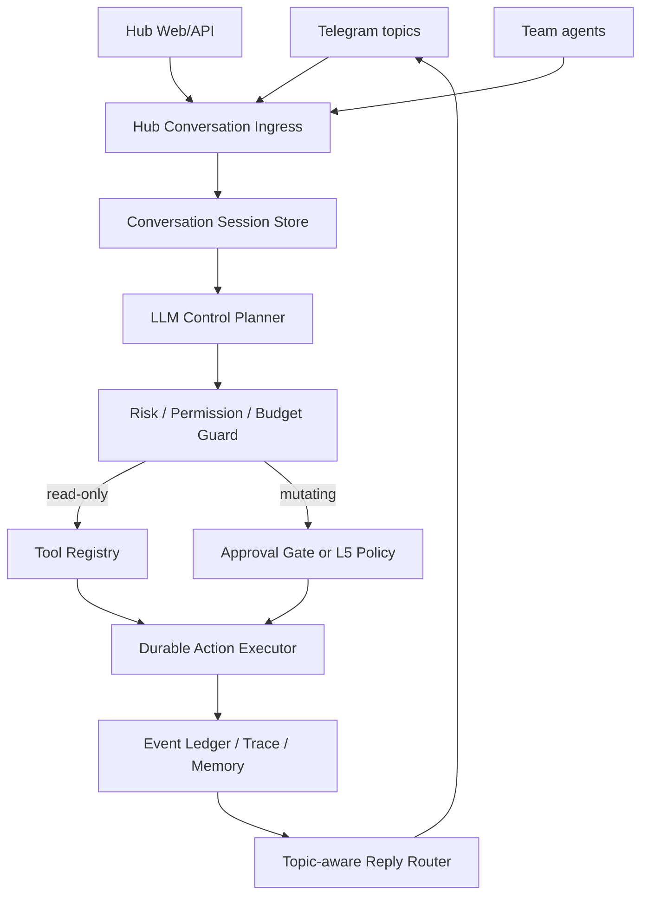
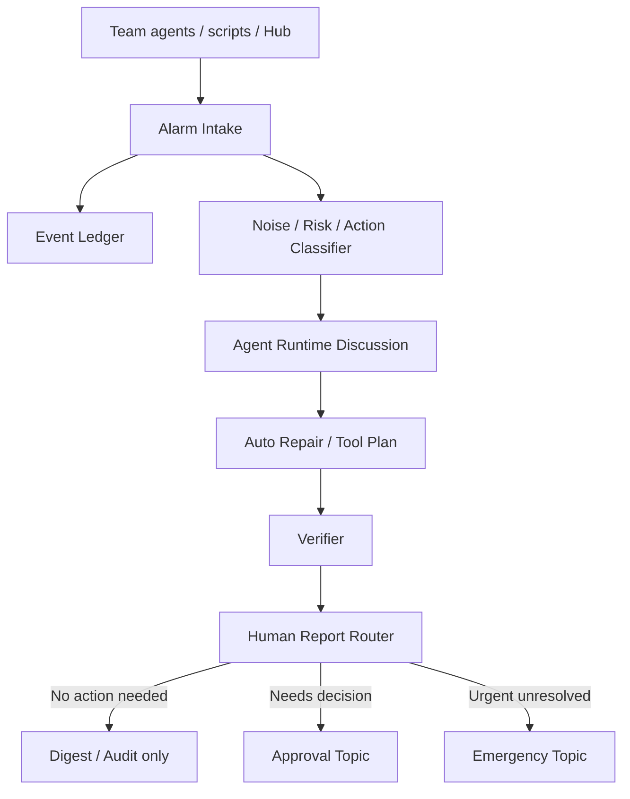
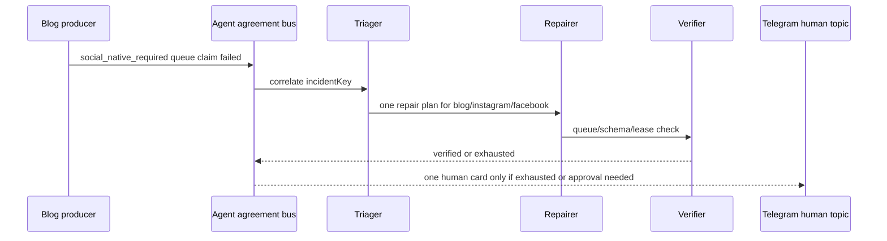

# Team Jay Autonomous Orchestration Design

작성일: 2026-04-25
상태: 설계 검토안
범위: Hub/retired gateway 완전 분리, Telegram topic 기반 운영 채널, LLM chat 기반 자율 제어면

## 1. 결론

Team Jay는 retired gateway를 런타임 의존성으로 취급하지 않는다. 외부 레퍼런스에서 가져올 것은 OAuth/profile/CLI adapter 패턴이지, process, workspace, webhook, auth profile store 그 자체가 아니다.

목표 아키텍처는 다음이다.



핵심 변화는 네 가지다.

1. **Retired gateway 분리**: legacy alarm shim, retired workspace path, port `18789`, auth profile store는 모두 compatibility layer로 낮춘다.
2. **Jay 제어면 개선**: Telegram은 단순 알림이 아니라 `observe -> analyze -> propose -> execute -> verify`를 수행하는 topic 기반 운영 콘솔이 된다.
3. **Intent engine 축소**: slash/keyword/learned intent 라우팅을 유지하되, 새 제어면은 "인텐트 분류"가 아니라 LLM이 tool catalog와 system state를 보고 계획을 생성하는 chat-control runtime으로 전환한다.
4. **사람 알림 최소화**: 에이전트 간 협의와 자동 복구를 기본값으로 두고, 사람에게는 정말 필요한 결정/장애/요약만 보낸다.

## 2. 외부 레퍼런스에서 가져올 원칙

### Legacy Gateway Reference

외부 레퍼런스의 OAuth 문서는 token/profile 저장을 per-agent auth profile에 두고, legacy OAuth 파일은 import-only로 유지하는 구조를 설명한다.

이 구조에서 배울 점은 **provider별 token profile과 runtime profile을 분리하는 패턴**이다. 반대로 Team Jay가 피해야 할 점은 external gateway state dir, gateway, hook, auth profile 파일에 직접 의존하는 것이다.

### OpenAI

OpenAI는 Responses API를 agent 구축의 미래 방향으로 설명하고, Chat Completions에서 점진 이관을 권장한다. 참고: [Migrate to the Responses API](https://platform.openai.com/docs/guides/migrate-to-responses). Responses API는 MCP tools, function calling, conversation state를 한 인터페이스에서 다룬다. 참고: [Responses API reference](https://platform.openai.com/docs/api-reference/responses).

OpenAI Agents SDK는 guardrails와 tracing을 1급 개념으로 둔다. Guardrails는 input/output/tool call 단계에서 tripwire를 걸 수 있고, tracing은 agent run, generation, tool call, handoff를 기본 span으로 기록한다. 참고: [OpenAI Agents guardrails](https://openai.github.io/openai-agents-python/guardrails/), [OpenAI Agents tracing](https://openai.github.io/openai-agents-js/guides/tracing/).

Team Jay 적용점:

- `/hub/llm/call`은 Responses API 중심으로 통일한다.
- 모든 LLM 제어 실행은 `traceId`, `conversationId`, `planId`, `toolCallId`를 남긴다.
- 도구 실행 전후 guardrail을 둔다.

### Claude Agent SDK / Claude Code

Claude Code SDK는 Claude Agent SDK로 이름이 바뀌었고, 프로덕션 에이전트를 위한 built-in tools, hooks, subagents, MCP, permissions, sessions를 제공한다. 참고: [Claude Agent SDK overview](https://code.claude.com/docs/en/agent-sdk/overview).

중요한 제약도 있다. Anthropic 공식 문서는 별도 승인 없이는 third-party developers가 claude.ai login/rate limits를 제품에 제공하는 것을 허용하지 않으며, API key 인증을 사용하라고 안내한다. 같은 문서는 Claude SDK가 `.claude/`와 `~/.claude/` 설정을 읽을 수 있고, `settingSources`로 제한할 수 있다고 설명한다.

Team Jay 적용점:

- Claude는 L5 stable path에서 Anthropic API key 또는 Claude Agent SDK 공식 인증만 기본값으로 쓴다.
- Claude Code CLI/설정 재사용은 Hub-owned adapter로 격리하고 retired auth profile은 읽지 않는다.
- `.claude` 설정 로드는 `settingSources`로 명시 제한한다.

### Agent orchestration

LangGraph durable execution 문서는 checkpoint, thread id, idempotent side effects를 강조한다. 특히 side effect와 non-deterministic operation은 task/node로 감싸야 재실행 중복을 막을 수 있다. 참고: [LangGraph durable execution](https://docs.langchain.com/oss/python/langgraph/durable-execution).

Microsoft Agent Framework의 group chat orchestration은 중앙 orchestrator가 speaker selection과 conversation flow를 관리하는 star topology를 설명한다. 참고: [Microsoft Agent Framework group chat](https://learn.microsoft.com/en-us/agent-framework/workflows/orchestrations/group-chat).

CrewAI는 agents, crews, flows를 제공하며 guardrails, memory, knowledge, observability를 포함한 협업형 agent runtime을 표방한다. 참고: [CrewAI docs](https://docs.crewai.com/).

AutoGen 연구/발표는 actor model과 event-driven message exchange를 통해 agent 간 전달 방식과 처리 방식을 분리하는 방향으로 진화했다. 참고: [Microsoft Research AutoGen](https://www.microsoft.com/en-us/research/publication/autogen-enabling-next-gen-llm-applications-via-multi-agent-conversation-framework/).

2026년 4월 arXiv의 scheduler-theoretic agent execution 논문은 agent loop의 약점을 implicit dependency, unbounded recovery loop, mutable execution history로 요약하고, 실행 계획/실행/복구를 분리한 structured graph harness를 제안한다. 참고: [From Agent Loops to Structured Graphs](https://arxiv.org/abs/2604.11378).

Team Jay 적용점:

- 채팅형 제어면이어도 실행은 durable graph/job으로 내려야 한다.
- LLM이 직접 "명령 실행"하지 않고 plan을 생성한다.
- executor는 plan version, node state, idempotency key, rollback strategy를 저장한다.

### Community repo deep dive

이번 설계는 단일 참고 구현에 묶이지 않고, 현재 커뮤니티에서 실제로 쓰이는 agent workflow 레포의 공통 패턴도 반영한다.

| 레퍼런스 | 확인한 패턴 | Team Jay 채택 | 피해야 할 점 |
| --- | --- | --- | --- |
| [gstack](https://github.com/garrytan/gstack), [gstack docs](https://gstack.lol/) | `Think -> Plan -> Build -> Review -> Test -> Ship -> Reflect` 순서의 delivery loop, role별 slash skill, 브라우저 QA와 release discipline | Jay control plan에 `frame/plan/review/test/ship/reflect` 게이트를 playbook으로 추가한다. 자연어 지시도 바로 실행하지 않고 "문제 재정의 -> 계획 잠금 -> 검증"을 통과시킨다. | Markdown skill을 runtime policy처럼 과신하지 않는다. 실제 실행/권한/중복 방지는 Hub executor가 담당해야 한다. |
| [OpenClaude](https://github.com/Gitlawb/openclaude) | provider profile, `agentRouting`, tool-driven CLI, slash commands, MCP, headless gRPC streaming permission events | Hub LLM provider/profile registry와 agent별 model routing을 강화한다. Telegram/Jay도 "interactive CLI"가 아니라 headless control server와 permission event stream으로 붙인다. | plaintext provider settings, unofficial OAuth/session store, provider별 기능 차이를 숨기는 추상화는 피한다. token은 Hub token broker가 재귀 redaction/canary와 함께 소유한다. |
| [Hermes Agent](https://github.com/NousResearch/hermes-agent), [subagent delegation](https://hermes-agent.nousresearch.com/docs/user-guide/features/delegation) | single gateway process, CLI/Telegram/Slack 등 공통 conversation, persistent memory, isolated subagents, restricted toolsets, parent에는 final summary만 반영 | Team Jay의 agent-runtime topic을 Hub 내부 message bus로 승격한다. subagent는 fresh context, restricted toolset, max concurrency/depth, final summary only를 기본 계약으로 둔다. | subagent가 직접 사람에게 메시지/approval/memory write를 하지 못하게 한다. gateway 편의성 때문에 tool permission을 우회하지 않는다. |
| Calyx/terminal MCP community signal | terminal 자체를 MCP message bus로 만들어 `register/list/send/ack/status` 식 agent IPC를 제공 | Jay 내부 메시지도 `register_agent`, `send_agent_message`, `ack_agent_message`, `get_agent_status` 같은 명시적 envelope로 표준화한다. | 에이전트끼리 무제한 DM을 열지 않는다. 모든 IPC는 incident/run/trace에 귀속되고 Hub policy를 통과해야 한다. |
| [Claude Code design-space analysis](https://arxiv.org/abs/2604.14228) | permission modes, context compaction, MCP/plugins/skills/hooks, worktree-isolated subagents, append-oriented session storage | Team Jay도 "LLM loop"보다 주변 시스템에 투자한다. 권한 모드, append-only session/event ledger, context compaction, tool extensibility를 control plane의 핵심으로 둔다. | 채팅 루프가 성공해 보인다고 permission/ledger/compaction을 나중으로 미루지 않는다. L5에서는 주변 시스템이 본체다. |

요약하면, Team Jay의 목표는 특정 gateway를 다시 만드는 것이 아니라 **gstack의 delivery discipline + OpenClaude의 provider/tool abstraction + Hermes의 gateway/subagent/memory 구조 + Hub-owned policy/executor**를 합친 운영 제어면이다.

## 3. 현재 Team Jay 상태

### 이미 좋은 기반

- Hub는 `createHubApp`, route registry, request context, LLM schema validation, OAuth redaction, Hub alarm client로 분리되기 시작했다.
- `hub-alarm-client`가 retired webhook보다 우선되는 구조로 이동했다.
- LLM Hub는 provider registry, circuit breaker, critical-chain registry, cache, stats endpoint를 이미 보유한다.
- Telegram은 forum topic 기반 발송 구조를 갖고 있다.
- `telegram-sender`는 2초 팀별 batch, Telegram 429 retry, pending queue를 갖고 있다.
- Hub alarm route는 event lake duplicate 감지와 severity 기반 Telegram routing을 갖고 있다.
- `reporting-hub`는 per-call dedupe/cooldown/quiet-hours policy를 이미 제공한다.
- Orchestrator는 slash/keyword/learned/LLM intent parser, unknown phrase promotion, rollback, team health command를 갖고 있다.

### 남은 retired gateway 결합

대표 결합 지점:

- `packages/core/lib`의 legacy alarm shim: 현재는 Hub alarm 재수출만 담당하지만 여전히 오래된 import가 남아 있다.
- legacy loader: 오래된 runtime bundle 호환용으로만 유지한다.
- `packages/core/lib/telegram-sender.ts`: pending queue가 Hub runtime path로 이동했다.
- `bots/orchestrator/src/mainbot.ts`: retired compatibility shim이다. 실제 runtime은 `jay-runtime.ts`로 이동했다.
- `bots/orchestrator/src/dashboard.ts`: retired gateway를 readiness core에서 제외했다.
- `bots/orchestrator/lib/steward/*session-manager.ts`: retired session repair는 active runtime isolation smoke로 차단한다.
- `packages/core/lib/hub-client.ts`: secret category는 `legacy_gateway`를 우선하고 retired alias는 compatibility only로 남긴다.

### 현재 알람 문제

지금 Telegram 알람은 운영자가 모두 읽고 판단하기 어려운 수준까지 늘어날 수 있다. 원인은 "모든 팀 이벤트를 사람 채널로 보낸다"는 과거 mainbot/alert-publisher 관성이 아직 남아 있기 때문이다.

프로젝트 전체에서 확인한 알람 경로:

| 경로 | 현재 역할 | 문제 |
| --- | --- | --- |
| `packages/core/lib/telegram-sender.ts` | 모든 팀의 topic 발송, 2초 batch, rate-limit retry | batch window가 짧고 사람/agent/audit 트래픽을 구분하지 않는다. pending queue는 Hub runtime path 기준이다. |
| `bots/hub/lib/routes/alarm.ts` | `/hub/alarm` 수신, event lake 기록, duplicate 감지, Telegram 발송 | 중복 감지는 exact-message 중심이라 유사 반복/폭주/복구 진행 중 알람을 충분히 묶지 못한다. |
| `packages/core/lib/reporting-hub.ts` | payload normalization, webhook/telegram/queue/n8n/RAG 발행 | cooldown/quiet-hours가 opt-in이라 호출자가 빠뜨리면 사람 채널이 시끄러워진다. |
| team-specific `publishAlert`/`publishToMainBot` alias | 팀별 알림 호환 계층 | 이름과 정책이 legacy mainbot 관성을 일부 유지한다. |
| n8n Telegram workflow | 일부 critical/daily 전송 | Hub alarm policy와 독립 동작하면 중복 보고가 생길 수 있다. |

따라서 L5 설계의 기본 계약은 **event는 많이 기록하되, 사람에게 보내는 message는 적게 보낸다**가 되어야 한다.

현재 자동 인벤토리 기준:

- `hub_alarm_native`: 148
- `legacy_gateway_compat`: 0

## 4. Target system

### 4.1 Hub Control Plane

Hub는 다음 domain으로 분리한다.

```text
bots/hub/src/
  domains/
    conversation/
      ingress.ts
      session-store.ts
      reply-router.ts
    control/
      planner.ts
      plan-schema.ts
      risk-policy.ts
      approval-gate.ts
      executor.ts
    tools/
      registry.ts
      tool-contract.ts
      tool-guardrails.ts
    telegram/
      update-router.ts
      topic-router.ts
      callback-router.ts
    oauth/
    llm/
    alarm/
```

새 API:

| Method | Path | 역할 |
| --- | --- | --- |
| `POST` | `/hub/conversation/message` | Telegram/Web/API 공통 메시지 ingress |
| `POST` | `/hub/control/plan` | LLM planner가 tool plan 생성 |
| `POST` | `/hub/control/execute` | 승인된 plan 실행 |
| `GET` | `/hub/control/runs/:id` | 실행 상태/trace 조회 |
| `POST` | `/hub/control/runs/:id/approve` | topic 버튼/명령 기반 승인 |
| `POST` | `/hub/control/runs/:id/cancel` | 실행 취소 |
| `GET` | `/hub/tools` | tool catalog |
| `POST` | `/hub/tools/:name/call` | guardrail 적용된 tool call |

### 4.2 Chat-control runtime

현재 intent parser는 보조 레이어로 유지하되, 새 runtime은 아래 절차를 따른다.

1. Telegram 또는 API 메시지 수신
2. session context 로드: user, topic, recent messages, team state, active incidents
3. LLM planner 호출: "사용자가 원하는 운영 목표"를 plan JSON으로 변환
4. risk policy 평가
5. read-only plan은 즉시 실행
6. low-risk mutating plan은 L5 policy 충족 시 자동 실행
7. high-risk plan은 approval topic으로 이동
8. executor가 durable node 실행
9. verifier가 결과를 확인하고 reply/audit 기록

Plan schema 예시:

```json
{
  "goal": "루나팀 주문 pending reconcile 상태 점검 후 자동 복구",
  "risk": "medium",
  "requiresApproval": false,
  "team": "luna",
  "steps": [
    {
      "id": "inspect_health",
      "tool": "hub.health.query",
      "args": { "team": "luna" },
      "sideEffect": "none"
    },
    {
      "id": "run_smoke",
      "tool": "repo.command.run",
      "args": { "cmd": "npm --prefix bots/investment run runtime:binance-order-pending-reconcile-smoke -- --json" },
      "sideEffect": "read_only"
    }
  ],
  "verify": [
    { "tool": "hub.event.query", "args": { "event_type": "manual_reconcile_required", "since": "1h" } }
  ]
}
```

핵심은 LLM이 shell을 직접 갖는 것이 아니라, Hub tool registry 안의 typed tool만 호출하게 하는 것이다.

### 4.3 Telegram topic channel levels

Telegram은 아래 단계로 분리한다.

| Level | Topic | 목적 | 자동 실행 |
| --- | --- | --- | --- |
| L0 | `general` | 일반 대화/상태 요약 | read-only만 |
| L1 | `team/*` | 팀별 운영 상태, warning, local diagnosis | low-risk read/write 가능 |
| L2 | `ops-control` | 시스템 점검, 재시작, queue repair | approval 또는 L5 policy 필요 |
| L3 | `approval` | high-risk action 승인/거절 | 버튼/명령 필요 |
| L4 | `emergency` | 장애/거래/데이터 손상 위험 | fail-closed, 사람 호출 우선 |
| L5 | `audit-log` | 실행 결과, plan, trace, diff, 검증 | 발행 전용 |
| internal | `agent-runtime` | 에이전트 간 메시지/heartbeat | 사람 채널과 분리 |

규칙:

- 일반 대화 topic에서는 고위험 조치가 실행되지 않는다.
- approval topic은 버튼 기반 `approve/reject/defer`만 허용한다.
- emergency topic은 자동 조치보다 상태 보존과 알림 중복 방지가 우선이다.
- agent-runtime topic은 사람이 읽지 않아도 되는 내부 coordination을 담당해 대화 채널을 오염시키지 않는다.

### 4.4 Alert governance

Telegram은 더 이상 raw event stream이 아니다. 사람에게 보이는 Telegram은 **decision inbox**이며, raw stream은 event lake, agent-runtime topic, audit-log topic으로 내려간다.

새 알람 파이프라인:



핵심 원칙:

- 모든 이벤트는 `event_lake`와 audit trace에 저장한다.
- 기본 visibility는 `internal`이다. 사람 채널은 opt-out이 아니라 **opt-in 승격**이어야 한다.
- 동일 원인 반복은 incident key로 병합한다.
- 에이전트가 처리 가능한 알람은 먼저 agent-runtime에서 협의하고 자동 복구를 시도한다.
- 복구 성공은 사람에게 즉시 보내지 않고 digest/audit에만 기록한다.
- 사람에게 즉시 보내는 것은 `money_movement`, `data_loss_risk`, `manual_approval_required`, `auto_repair_exhausted`, `critical_service_down`뿐이다.

알람 visibility 정책:

| Visibility | 사람 Telegram 발송 | 예시 |
| --- | --- | --- |
| `internal` | 없음 | heartbeat, retry 시작, recoverable quality gate, smoke detail |
| `audit_only` | 없음, audit-log 기록 | 자동 복구 성공, 중복 suppress, dry-run 결과 |
| `digest` | 정해진 요약 시간에만 | 팀별 warning 누적, publish queue backlog, provider 429 회복 |
| `human_action` | approval/topic에 단일 카드 | 승인 필요, 정책 변경 필요, 수동 credential 갱신 필요 |
| `emergency` | emergency topic 즉시 | 거래 중복 위험, 데이터 오염 위험, 핵심 서비스 장기 down |

알람 event schema 확장:

```ts
type GovernedAlarm = {
  team: string;
  source: string;
  eventType: string;
  severity: 'info' | 'warn' | 'error' | 'critical';
  incidentKey: string;
  visibility: 'internal' | 'audit_only' | 'digest' | 'human_action' | 'emergency';
  actionability: 'none' | 'auto_repair' | 'needs_approval' | 'needs_human';
  status: 'new' | 'correlating' | 'repairing' | 'verified' | 'exhausted';
  summary: string;
  evidence: unknown;
  recommendedAction?: string;
  suppressUntil?: string;
};
```

Agent 협의 모델:

| 역할 | 책임 | 사람 보고 조건 |
| --- | --- | --- |
| `producer` | 원본 이벤트 기록 | 직접 보고 금지 |
| `triager` | 중복/심각도/visibility 결정 | emergency만 즉시 보고 |
| `diagnoser` | 원인 후보와 영향 범위 분석 | high-risk 불확실성만 보고 |
| `repairer` | 허용된 tool registry 조치 수행 | 승인 필요 시 보고 |
| `verifier` | 조치 성공/회귀 여부 확인 | 실패 누적 또는 불일치 시 보고 |
| `summarizer` | digest/audit/human card 생성 | 최종 메시지만 보고 |

사람에게 가는 메시지 형식은 항상 단일 카드다.

```text
[팀/서비스] 무엇이 문제인가
영향: 사용자/돈/데이터/운영 중 어디에 영향이 있는가
자동 처리: 무엇을 시도했고 결과가 무엇인가
필요한 결정: 승인/대기/수동조치 중 무엇인가
버튼: approve / reject / defer / details
```

금지 사항:

- `info`/`warn` raw event를 사람 topic에 즉시 보내지 않는다.
- 동일 incident의 반복 메시지를 매번 보내지 않는다.
- stack trace, 긴 JSON, smoke 전체 로그를 사람 Telegram에 직접 보내지 않는다.
- agent 간 협의/재시도/부분 결과를 사람 채널에 흘리지 않는다.
- Retired webhook fallback을 사람 알림의 필수 경로로 두지 않는다.

구현 포인트:

- Hub alarm route에 `incidentKey`, `visibility`, `actionability`, `status`를 추가한다.
- `reporting-hub`의 cooldown/quiet-hours/dedupe를 opt-in이 아니라 기본 정책으로 바꾼다.
- `telegram-sender`는 `human_action`/`emergency`만 즉시 발송하고, `digest`는 digest queue에 적재한다.
- `agent-runtime` topic 또는 별도 event stream을 만들어 에이전트 협의 메시지를 사람 topic에서 분리한다.
- n8n Telegram workflow도 Hub alarm governor를 경유하지 않으면 발송하지 않게 한다.
- "details" 버튼은 긴 로그를 직접 보내지 않고 trace/audit 링크 또는 요약 조회 command로 연결한다.

수용 기준:

- 같은 incident가 1시간에 100번 발생해도 사람에게는 최대 1개의 active card와 1개의 digest만 간다.
- 자동 복구 성공 사건은 즉시 Telegram에 뜨지 않고 audit/digest로만 남는다.
- emergency는 1분 안에 도착하되, 같은 incident는 update thread/card로 병합된다.
- 사용자가 "자세히"를 누르기 전까지 긴 로그/JSON은 보이지 않는다.
- Retired gateway down 상태에서도 alarm intake, agent 협의, digest, approval, emergency가 동작한다.

### 4.4.1 Agent agreement bus

완전자율운영에서 "협의"는 Telegram 사람 topic에서 일어나면 안 된다. 협의는 Hub 내부 agent agreement bus에서 일어나고, 사람에게는 결론만 올라간다.

Message envelope:

```ts
type AgentMessage = {
  id: string;
  traceId: string;
  runId?: string;
  incidentKey?: string;
  from: string;
  to: string | 'broadcast';
  role:
    | 'producer'
    | 'triager'
    | 'diagnoser'
    | 'repairer'
    | 'verifier'
    | 'summarizer'
    | 'planner'
    | 'subagent';
  phase:
    | 'observe'
    | 'frame'
    | 'plan'
    | 'execute'
    | 'verify'
    | 'reflect';
  visibility: 'internal' | 'audit_only' | 'digest' | 'human_action' | 'emergency';
  payload: unknown;
  expiresAt?: string;
  ackRequired: boolean;
};
```

협의 규칙:

- `register_agent`, `list_agents`, `send_agent_message`, `ack_agent_message`, `get_agent_status`를 Hub internal tool로 제공한다.
- subagent는 부모 대화 기록을 상속하지 않는다. 필요한 context는 parent가 명시적으로 전달한다.
- subagent toolset은 parent toolset의 부분집합이어야 한다.
- subagent는 `send_telegram`, `approval`, `memory_write`, `delegate_task`를 기본 차단한다.
- parent context에는 child의 중간 로그가 아니라 final summary와 typed result만 들어간다.
- agent-runtime bus에는 concurrency limit, max depth, timeout, interrupt, heartbeat가 필요하다.
- 모든 agent message는 `traceId/runId/incidentKey` 중 하나에 귀속되어야 하며 고아 메시지는 거부한다.

이 구조를 쓰면 현재 "블로그/인스타/페이스북 모두 같은 알람" 같은 상황은 다음 흐름으로 바뀐다.



### 4.4.2 Jay playbooks

Jay는 단순 LLM planner가 아니라 playbook coordinator가 되어야 한다. gstack의 단계형 workflow를 운영용으로 바꾸면 다음과 같다.

| Phase | Jay 질문 | 자동/사람 |
| --- | --- | --- |
| `frame` | 이 이벤트는 하나의 incident인가, 여러 사건인가? | 자동 |
| `plan` | 어떤 tool sequence가 최소 리스크인가? | 자동, high-risk는 approval |
| `review` | 계획이 중복 실행/권한/데이터 오염에 안전한가? | verifier/guardrail |
| `execute` | idempotency key가 있는 step만 실행한다 | executor |
| `test` | smoke/health/event ledger로 검증한다 | verifier |
| `ship` | 상태를 닫고 audit/digest를 남긴다 | 자동 |
| `reflect` | 재발 방지 rule/playbook/skill을 제안한다 | digest 또는 문서 PR |

모든 L5 자동조치는 위 phase 중 `frame/plan/review/test`가 비어 있으면 실행하지 않는다.

### 4.5 Tool registry

모든 조치는 typed tool로 등록한다.

```ts
type HubTool = {
  name: string;
  ownerTeam: string;
  description: string;
  inputSchema: JsonSchema;
  sideEffect: 'none' | 'read_only' | 'write' | 'external_mutation' | 'money_movement';
  defaultRisk: 'low' | 'medium' | 'high' | 'critical';
  timeoutMs: number;
  idempotencyKey?: (input: unknown, context: HubRequestContext) => string;
  requiredTopicLevel: 'L0' | 'L1' | 'L2' | 'L3' | 'L4';
  handler: (input: unknown, context: HubRequestContext) => Promise<unknown>;
};
```

초기 tool groups:

- `hub.health.*`: Hub/팀 health query
- `launchd.*`: status, restart, bootstrap, unload
- `repo.*`: git status, test, check, patch plan
- `luna.*`: portfolio read, reconcile queue read, guarded remediation
- `blog.*`: publish queue inspect, campaign repair, dry-run
- `claude.*`: auto-dev status, backlog, canary
- `telegram.*`: topic message, approval buttons, audit fanout
- `agent_bus.*`: agent register/list/send/ack/status, incident discussion read
- `playbook.*`: frame/plan/review/test/reflect templates, runbook suggestion

Toolset policy:

- 사람 채널 발송 tool은 `summarizer`와 `approval/emergency router`만 사용할 수 있다.
- subagent toolset은 parent보다 넓어질 수 없다.
- `memory_write`는 reflect phase에서 verifier가 성공을 확인한 뒤에만 가능하다.
- provider/model routing은 task role 기준으로 고정한다. 예: cheap model은 summarization/digest, strong model은 high-risk plan review, deterministic script는 verification.

### 4.6 Durable executor

현재 launchd/스크립트 중심 실행은 process crash에 약하다. L5 executor는 최소 Postgres 기반 durable job으로 시작하고, 이후 필요 시 Temporal/LangGraph/BullMQ로 확장한다.

테이블 초안:

```sql
CREATE TABLE hub.control_runs (
  id uuid PRIMARY KEY,
  conversation_id uuid NOT NULL,
  plan_version text NOT NULL,
  status text NOT NULL,
  risk text NOT NULL,
  created_by text NOT NULL,
  topic_level text NOT NULL,
  plan jsonb NOT NULL,
  result jsonb,
  error jsonb,
  created_at timestamptz DEFAULT now(),
  updated_at timestamptz DEFAULT now()
);

CREATE TABLE hub.control_steps (
  run_id uuid NOT NULL,
  step_id text NOT NULL,
  status text NOT NULL,
  idempotency_key text,
  input jsonb,
  output jsonb,
  error jsonb,
  started_at timestamptz,
  finished_at timestamptz,
  PRIMARY KEY (run_id, step_id)
);
```

실행 규칙:

- 모든 mutating step은 idempotency key 필수.
- retry는 executor가 한다. LLM이 "다시 시도" 루프를 직접 돌지 않는다.
- verifier step 실패 시 `needs_review` 또는 `repair_queued`로 남긴다.
- audit-log topic에는 plan/result/trace link만 발행하고 secret은 redaction한다.

### 4.7 Memory and learning lanes

Hermes의 closed learning loop는 유용하지만, L5 운영에서는 memory write가 곧 정책 변경이 될 수 있다. Team Jay는 memory를 네 갈래로 분리한다.

| Lane | 저장 위치 | 쓰기 권한 | 예시 |
| --- | --- | --- | --- |
| `session` | conversation/session store | conversation runtime | 현재 Telegram 대화, 최근 명령 |
| `event` | event ledger | 모든 producer append-only | raw alarm, tool result, trace |
| `operational` | incident/run memory | verifier/summarizer | "이 queue claim 실패는 schema drift였다" |
| `playbook` | docs/runbooks/skills | 사람 승인 또는 low-risk PR | "블로그 social_native_required 복구 절차" |

subagent는 `session/event` read만 기본 허용하고, `operational/playbook` write는 parent verifier가 대신 수행한다.

## 5. Retired gateway 완전 분리 로드맵

### Phase A: compatibility surface 축소

- legacy alarm shim import를 `hub-alarm-client`로 팀별 이관한다.
- retired gateway env aliases는 `HUB_*` 이름을 우선하고 legacy fallback으로만 유지한다.
- retired workspace pending queue/lock을 `bots/hub/runtime` 또는 `/tmp/team-jay`로 이동한다.
- dashboard에서 retired gateway를 required core service에서 제거한다.

완료 조건:

- `legacy_gateway_compat` 0으로 compatibility inventory 제거 완료.
- Retired gateway launchd down 상태에서 `/hub/health`, Telegram alarm, LLM stable path 정상.

### Phase B: OAuth/token broker 독립

- OpenAI: API key + Responses API stable, Codex OAuth는 canary-gated experimental.
- Claude: Anthropic API key 또는 Claude Agent SDK official auth stable, Claude CLI adapter는 Hub-owned.
- Hub token store는 provider, scopes, expiry, last_canary, last_refresh_error를 저장한다.
- status endpoint는 recursive redaction과 canary 결과만 반환한다.

완료 조건:

- `/hub/oauth/openai/status`, `/hub/oauth/claude/status`가 retired gateway 없이 동작.
- Retired auth profile 파일 삭제/이동 후에도 LLM canary 통과.

### Phase C: control plane 출시

- `/hub/conversation/message` 추가.
- Telegram callback poller를 `darwin_` 전용에서 generic `hub_control:*`로 확장.
- LLM planner + tool registry + approval gate MVP 구현.
- Jay router는 legacy command route로 유지하되, 자연어 운영 요청은 control plane으로 우회.

완료 조건:

- "루나팀 상태 보고 문제 있으면 조치해줘" 같은 자연어가 plan -> execute -> verify -> audit로 닫힌다.
- high-risk tool은 approval 없이 실행되지 않는다.

### Phase D: durable orchestration

- Postgres durable executor로 시작한다.
- 장기 작업/복구가 늘면 LangGraph 또는 Temporal을 도입한다.
- agent-runtime topic과 audit-log topic을 분리한다.

완료 조건:

- Hub 재시작 중 run이 중복 실행되지 않는다.
- 실행 중단 후 last checkpoint에서 재개된다.
- LLM recovery loop가 3회 이상 반복되지 않는다.

### Phase E: retired gateway 제거 완료

- legacy alarm shim은 compile-time compatibility만 남기고 network fallback은 기본 비활성화한다.
- retired gateway env fallback은 migration window 이후 제거한다.
- retired workspace runtime path, lock, queue, logs 참조를 Hub/Jay runtime path로 모두 이동한다.
- retired gateway launchd와 health dependency를 운영 필수 목록에서 제거한다.
- Retired auth profile import는 one-shot migration tool로만 남기고 runtime read를 금지한다.

완료 조건:

- retired gateway literal search 결과가 문서/마이그레이션/compat shim 외에는 0건이다.
- Retired gateway process, port `18789`, auth profile store가 없어도 Hub/Jay/Telegram/LLM smoke가 통과한다.
- 사람 알림 경로가 Hub alarm governor만 통과한다.

## 6. Build vs adopt 결정

| 영역 | 권장 | 이유 |
| --- | --- | --- |
| LLM provider API | 직접 구현 | 이미 Hub LLM/fallback/circuit 구조가 있고 provider 계약이 작다. |
| OAuth broker | 직접 구현 | token/security/redaction은 Team Jay 소유가 안전하다. |
| Telegram topic console | 직접 구현 | 우리 운영 채널/팀 topic 규칙이 특화되어 있다. |
| Alert governor | 직접 구현 | 사람 알림 기준은 우리 운영 리스크/팀 구조에 강하게 종속된다. |
| Durable graph | 초기 직접(Postgres), 이후 LangGraph/Temporal 평가 | 바로 큰 프레임워크를 넣으면 현재 시스템과 충돌 가능. 단, checkpoint/idempotency 원칙은 즉시 적용. |
| Multi-agent conversation | 직접 구현 + Microsoft/AutoGen 패턴 차용 | star topology와 actor/event model을 구조 원칙으로 사용. |
| Crew/role abstraction | 참고만 | Team Jay는 이미 팀/에이전트 registry가 있어 CrewAI concepts와 중복된다. |
| Delivery workflow skills | gstack 패턴 차용, runtime 직접 구현 | Markdown skill은 사고 절차로 좋고, 실행 안전성은 Hub가 보장해야 한다. |
| Provider/profile routing | OpenClaude 패턴 차용, token store 직접 구현 | provider abstraction은 유용하지만 token/plaintext/auth 구현은 Hub-owned여야 한다. |
| Gateway/subagent/memory | Hermes 패턴 차용, 정책 직접 구현 | isolated subagent와 gateway는 유용하지만 message/memory/write 권한은 우리 정책으로 제한해야 한다. |

## 7. Immediate next tasks

1. **Retired runtime path 제거 1차**
   - `telegram-sender.ts`의 pending queue path를 Hub runtime path로 이동.
   - `jay-runtime.ts` lock path는 Hub/Jay runtime path를 사용한다.
   - 호환 fallback migration smoke 추가.

2. **Orchestrator dashboard 정리**
   - retired gateway를 core required에서 제거하고 `legacy compatibility` 섹션으로 이동.
   - `readRecentAlertSnapshot` import를 `hub-alarm-client`로 변경.

3. **Alarm governor MVP**
   - `/hub/alarm`에 `incidentKey`/`visibility`/`actionability`를 추가.
   - default policy를 `internal/digest first`로 변경.
   - `human_action`/`emergency` 외에는 즉시 Telegram 발송 금지.
   - 팀별 top noisy producer 리포트와 suppress rule dry-run 추가.

4. **Hub control plan schema 추가**
   - `bots/hub/lib/control/plan-schema.ts`
   - Zod/JSON schema 기반 risk/steps/verify 구조.
   - unit test 추가.

5. **Telegram callback generic화**
   - `telegram-callback-poller.ts`가 `hub_control:` prefix를 `/hub/control/callback`으로 전달.
   - Darwin callback은 compatibility route로 유지.

6. **Tool registry MVP**
   - read-only tools: `hub.health.query`, `launchd.status`, `repo.git_status`.
   - mutating tools는 아직 execute disabled로 등록만 한다.

7. **LLM planner MVP**
   - `/hub/control/plan`은 자연어를 plan JSON으로 변환하되 실행하지 않는다.
   - OpenAI Responses API primary, Claude Agent SDK fallback.
   - output guardrail: schema exact, unknown tool reject.

8. **L5 acceptance smoke**
   - retired gateway stopped 또는 port 18789 unavailable 상태에서 Hub health/alarm/control plan smoke 통과.
   - Telegram message -> plan draft -> audit-log dry-run까지 검증.
   - 100개 synthetic warning이 들어와도 사람 topic에는 digest 1건 이하만 발송되는지 검증.

9. **Agent agreement bus MVP**
   - `agent_bus.register/list/send/ack/status` internal tools 추가.
   - `incidentKey` 기준으로 블로그/인스타/페이스북 중복 알람을 하나의 discussion으로 병합.
   - 사람 Telegram에는 `auto_repair_exhausted` 또는 `approval_required` 전까지 발송하지 않는다.

10. **Jay playbook templates**
   - `frame/plan/review/test/ship/reflect` phase schema 추가.
   - gstack식 workflow를 운영 runbook으로 변환한다.
   - "루나팀 상태 점검하고 조치해줘"를 playbook plan으로 만들되 실행은 dry-run부터 시작한다.

11. **Subagent sandbox**
   - subagent는 fresh context, restricted toolset, max concurrency/depth, final summary only를 기본값으로 둔다.
   - `send_telegram`, `approval`, `memory_write`, `delegate_task`는 기본 차단한다.
   - parent가 필요한 context를 명시 전달하지 않으면 subagent spawn을 거부한다.

## 8. Risks

| Risk | 대응 |
| --- | --- |
| LLM chat-control이 너무 자유롭게 실행 | tool registry + risk gate + approval topic + idempotency key |
| Retired gateway 제거 중 기존 팀 알림 깨짐 | compatibility shim 유지, 팀별 이관, inventory 숫자 gate |
| Telegram 채널이 너무 시끄러워짐 | alarm governor, incident 병합, digest-first, agent-runtime 내부화 |
| 에이전트 협의가 문제를 숨김 | emergency escalation SLA, auto_repair_exhausted human_action, audit trace |
| 에이전트끼리 잘못 합의하고 사람에게 숨김 | verifier 독립 실행, sampled human digest, emergency hard rule, audit replay |
| subagent가 권한을 우회함 | parent toolset subset, blocked tools, max depth, final summary only, per-message trace |
| community repo 패턴을 과도하게 복사 | license/auth/security review, architecture pattern만 채택, token/runtime 구현은 직접 보유 |
| Durable executor 과설계 | Postgres MVP 먼저, long-running/parallel 요구가 확인되면 Temporal/LangGraph 도입 |
| Claude OAuth 정책 리스크 | 공식 API key/Agent SDK auth를 stable로 두고 claude.ai login/rate-limit 재판매처럼 보이는 구조 금지 |
| 고위험 작업 자동화 오작동 | money/external mutation은 approval 또는 팀별 L5 hard policy 필요 |

## 9. Review checklist

- Retired gateway binary/path/port 없이 core path가 동작하는가?
- 새 제어면이 intent keyword 추가 없이 자연어 목표를 plan으로 만들 수 있는가?
- plan 실행이 재시작/중복/부분 실패에 안전한가?
- Telegram topic이 대화, 승인, 감사, 내부 agent traffic을 분리하는가?
- 사람 Telegram으로 가는 메시지가 `human_action`/`emergency`/scheduled digest로 제한되는가?
- 같은 incident 반복이 card update/digest로 병합되는가?
- 에이전트가 자동 복구 가능한 이벤트를 먼저 협의/조치하고, 실패 시에만 사람에게 올리는가?
- agent agreement bus 메시지가 모두 `traceId/runId/incidentKey`에 귀속되는가?
- subagent가 fresh context, restricted toolset, max depth, final summary only 계약을 지키는가?
- Jay playbook이 `frame/plan/review/test` 없이 mutating step을 실행하지 않는가?
- provider token/status 응답이 secret을 절대 노출하지 않는가?
- 모든 mutating action에 idempotency key와 verifier가 있는가?
- L5 smoke가 "retired gateway off", "Hub restart", "Telegram callback retry", "provider 429"을 포함하는가?
- L5 smoke가 "alarm flood 100건 -> human Telegram 1건 이하"를 포함하는가?
