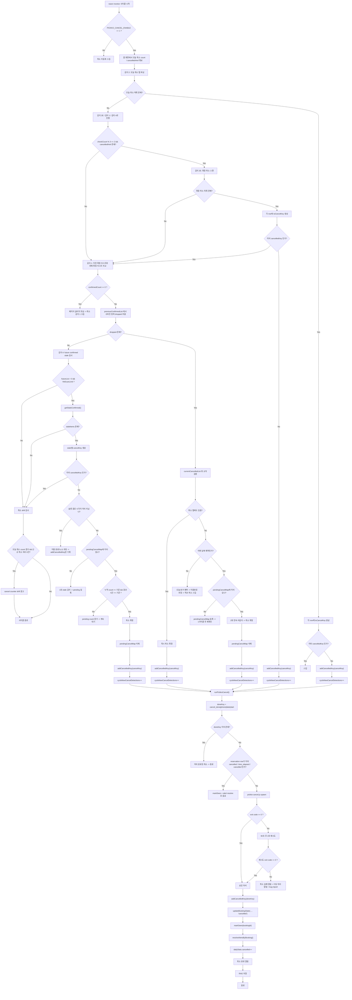

# 스카 네이버 자동 모니터링 예약취소 절차 Runbook (2026-03-22)

## 1. 목적

이 문서는 `naver-monitor` 런타임이 네이버 예약취소를 감지하고 픽코 취소까지 수행하는 현재 절차를 운영/개발 공통 기준으로 고정한다.

현재 source of truth:
- [naver-monitor.ts](/Users/alexlee/projects/ai-agent-system/bots/reservation/auto/monitors/naver-monitor.ts)

현재 운영 엔트리:
- [dist naver-monitor.js](/Users/alexlee/projects/ai-agent-system/dist/ts-runtime/bots/reservation/auto/monitors/naver-monitor.js)

현재 운영 원칙:
- 네이버 취소 감지
- 픽코 취소 실행
- 성공 시 예약 원장/알림 정리
- 추가 `unblock-slot` 후속은 수행하지 않음

---

## 2. 전제 조건

- `PICKKO_CANCEL_ENABLE=1`
- `naver-monitor` 실행 중
- 취소는 감지 경로가 여러 개이지만 실제 write-path는 `runPickkoCancel()` 하나로 수렴

---

## 3. 전체 흐름도

---

## 4. 감지 경로별 해설

### 4-1. 감지 2 — 오늘 취소 탭

가장 직접적인 감지 경로다.

절차:
1. `cancelledHref` 또는 fallback 취소 URL로 이동
2. `scrapeNewestBookingsFromList(page, 20)`로 취소 리스트 파싱
3. 각 row에 대해 `toCancelKey()` 생성
4. 이미 처리된 취소 키가 아니면 즉시 `runPickkoCancel()` 실행

의미:
- 신뢰도가 가장 높음
- 오늘 발생한 취소를 가장 빠르게 잡음

### 4-2. 감지 2E — 확장 취소 스캔

3사이클마다 한 번 동작하는 보강 레일이다.

목적:
- 오늘 취소 탭이 놓칠 수 있는 미래 예약 취소를 더 넓게 잡기 위함

### 4-3. 감지 1 — 확정 리스트 drop 비교

이전 사이클엔 확정이었는데 이번엔 사라진 항목을 찾는다.

분기:
- 취소 탭에도 있으면 즉시 취소 확정
- 미래 예약인데 취소 탭엔 없으면 `pendingCancelMap`에 등록 후 1사이클 더 재확인
- 오늘/과거 예약이면 이용완료 추정으로 스킵

### 4-4. 감지 4 — future stale

future confirmed 원장에 있던 미래 예약이 갱신되지 않으면 stale로 간주한다.

분기:
- 슬롯 종료 시각이 지났으면 취소 불필요 → 재감지 방지용 `cancelledKey`만 기록
- 아직 미래 슬롯이면 `pendingCancelMap`에 누적
- 기준 count와 경과시간을 넘으면 취소 확정

---

## 5. 실제 취소 실행 경로

함수:
- `runPickkoCancel(booking, cancelKey)`

핵심 분기:

1. `doneKey` 존재
- 이미 완료된 취소
- 즉시 종료

2. reservation row가 이미 `cancelled` 또는 `time_elapsed/cancelled`
- 이미 종결된 건
- `markSeen + alert resolve` 후 종료

3. 첫 취소 시도 성공
- `doneKey` 기록
- booking 상태 `cancelled`
- `markSeen`
- alert resolve
- 취소 완료 알림
- 종료

4. 첫 시도 실패
- 60초 후 1회 재시도

5. 재시도 성공
- 성공 처리와 동일

6. 재시도 실패
- 수동 취소 필요 알림
- bug report

중요:
- 현재는 성공 후 `unblock-slot` 후속 호출을 하지 않음
- 네이버 취소 시 슬롯은 이미 예약가능 상태로 복구된다는 운영 전제를 따른다

---

## 6. 운영 판정 포인트

### 성공 판정

- 취소 완료 알림 발생
- `reservations.status = cancelled`
- `cancelled_keys`와 `doneKey` 기록
- 중복 감지 없이 이후 사이클에서 재실행되지 않음

### 주의 판정

- `cancel counter drift` 경고
- `pendingCancelMap` 누적이 과도하게 오래 남음
- 미래 stale 경로가 자주 발생

### 실패 판정

- `pickko-cancel.js` 1차 실패 + 재시도 실패
- 수동 취소 필요 알림 발생

---

## 7. 다음 점검 항목

지금 당장 필요한 구조:
- 실제 취소 1건 live 관찰
- `cancelled_keys`, `doneKey`, `reservations`, `alerts` 동시 점검

나중에 확장할 구조:
- 감지 2 / 2E / 1 / 4 경로별 성공률 메트릭
- workspace별 취소 정책 분리
- 취소 경로별 false positive / false negative 계측
