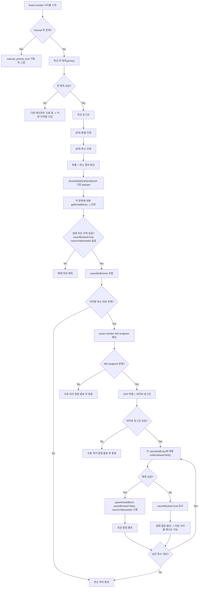

# 스카 픽코 자동 모니터링 예약취소 절차 Runbook (2026-03-22)

## 1. 목적

이 문서는 `pickko-kiosk-monitor` 런타임이 픽코 예약취소를 감지하고 네이버 예약가능 복구까지 수행하는 현재 절차를 운영/개발 공통 기준으로 고정한다.

현재 source of truth:
- [pickko-kiosk-monitor.ts](/Users/alexlee/projects/ai-agent-system/bots/reservation/auto/monitors/pickko-kiosk-monitor.ts)

현재 운영 엔트리:
- [dist pickko-kiosk-monitor.js](/Users/alexlee/projects/ai-agent-system/dist/ts-runtime/bots/reservation/auto/monitors/pickko-kiosk-monitor.js)

현재 운영 원칙:
- 픽코 취소 감지 = `상태=환불` + `상태=취소`
- 두 상태는 픽코 화면에서 중복 선택이 되지 않으므로 각각 따로 조회
- 두 결과를 합산/중복제거 후 실제 네이버 차단 이력이 있는 예약만 해제
- `manual` 픽코 작업이 진행 중이면 자동 모니터는 즉시 스킵

---

## 2. 전제 조건

- `kiosk-monitor` 실행 중
- `manual` 락이 없는 상태
- 픽코 로그인 성공
- 네이버 차단 해제는 `naver-monitor` 브라우저 세션(CDP)에 의존

운영 의미:
- 수동 작업이 진행 중이면 자동은 멈춘다
- 자동은 픽코 상태 감지와 네이버 후속 해제를 담당한다

---

## 3. 전체 흐름도

---

## 4. 취소 감지 입력 단계

### 4-1. 상태=환불 조회

먼저 픽코 예약 목록을 아래 조건으로 조회한다.

- 이용일 `>= today`
- 이용금액 `>= 1`
- 상태 = `환불`

의미:
- 결제 후 환불된 예약을 감지
- 금액이 있는 실제 예약 취소 흐름을 우선 포착

### 4-2. 상태=취소 조회

그다음 동일한 조건으로 상태만 바꿔 한 번 더 조회한다.

- 이용일 `>= today`
- 이용금액 `>= 1`
- 상태 = `취소`

의미:
- 환불까지 가지 않은 취소 예약 포착
- 픽코 관리자 화면의 상태 필터가 단일 선택이므로 별도 조회가 필요

### 4-3. 합산 및 중복 제거

`환불`과 `취소` 조회 결과를 합친 뒤 아래 key로 중복 제거한다.

- `phone|date|start|end|room`

이유:
- 같은 사람
- 같은 날짜
- 같은 시작시각
이라도 종료시각이나 룸이 다르면 다른 예약일 수 있기 때문

즉 현재 픽코 취소 감지 입력은
- `환불`
- `취소`
를 별도 수집한 뒤 하나의 `rawCancelledEntries`로 합치는 구조다.

---

## 5. 실제 해제 대상 판정

합산된 취소 목록 전체를 바로 해제하지는 않는다.

각 항목마다:
- `getKioskBlock(phone, date, start, end, room)` 조회

그 뒤 아래 조건을 모두 만족해야 `cancelledEntries`로 포함된다.

1. `kiosk_blocks` row가 존재
2. `saved.naverBlocked === true`
3. `saved.naverUnblockedAt` 없음

의미:
- 우리가 실제로 네이버에서 막았던 슬롯만 다시 연다
- 차단한 적 없는 예약은 해제하지 않는다
- 이미 해제한 예약은 중복 처리하지 않는다

운영 의미:
- 오탐 해제를 줄이는 보수적 구조

---

## 6. 네이버 세션 분기

### 6-1. `naver-monitor` WS endpoint 없음

상태:
- `naver-monitor` 브라우저 세션을 찾을 수 없음

동작:
- 각 취소 대상에 대해 수동 처리 알림 발송
- 자동 해제는 수행하지 않음

운영 의미:
- 취소 입력은 감지했지만 네이버 후속 레일이 없어 사람에게 즉시 넘김

### 6-2. 네이버 로그인 실패

상태:
- CDP 연결은 되었지만 네이버 booking 로그인 확인 실패

동작:
- 각 취소 대상에 대해 수동 처리 알림 발송
- 자동 해제는 수행하지 않음

운영 의미:
- 세션/인증 문제를 조용히 묻지 않고 운영 이슈로 승격

---

## 7. 실제 해제 실행 절차

각 `cancelledEntry`에 대해 아래 순서로 진행한다.

1. `unblockNaverSlot(naverPg, entry)` 호출
2. 실패 시 `detached Frame`이면 새 탭으로 1회 재시도
3. 그 외 예외는 fatal screenshot 저장 후 실패 처리

즉 기본 정책:
- 최대 2회 시도
- 1차는 현재 탭
- 필요 시 새 탭으로 1회 재시도

---

## 8. 성공 / 실패 분기

### 8-1. 성공

조건:
- `unblocked === true`

동작:
- 기존 `kiosk_blocks` row 재조회
- `upsertKioskBlock(...)`
  - `naverBlocked=false`
  - `naverUnblockedAt=nowKST()`
- 성공 알림 발송

성공 의미:
- 네이버 슬롯이 다시 예약가능 상태가 됨
- 원장도 같은 상태로 정렬됨

### 8-2. 실패

조건:
- `unblocked === false`

동작:
- `naverBlocked=true` 유지
- `naverUnblockedAt` 미기록
- 수동 처리 필요 알림 발송

실패 의미:
- 해제되지 않은 슬롯으로 남아 있으므로 다음 사이클에서 다시 후보가 될 수 있음

---

## 9. 운영 판정 포인트

### 성공 판정

- `✅ 네이버 예약불가 해제` 알림 발생
- 해당 row가 `naverBlocked=false`
- `naverUnblockedAt` 기록

### 주의 판정

- `환불` 또는 `취소` 조회 건수는 있는데 `처리 필요`가 0
- 이는 실제 차단한 적 없는 취소이거나, 이미 해제된 취소일 수 있음

### 실패 판정

- `⚠️ 네이버 차단 해제 실패 — 수동 처리 필요`
- 또는
- `naver-monitor 미실행`
- 또는
- `네이버 로그인 실패`

---

## 10. 지금 당장 필요한 구조 / 나중에 확장할 구조

### 지금 당장 필요한 구조

- `환불 + 취소` 이중 조회
- `phone|date|start|end|room` 기준 dedupe
- 실제 차단 이력 기반 해제 대상 판정
- 수동 락 우선

### 나중에 확장할 구조

- `환불 감지 수 / 취소 감지 수 / 실제 해제 필요 수 / 해제 성공 수 / 해제 실패 수` 메트릭화
- 상태 전이 audit trail 강화
- 멀티워크스페이스 SaaS 확장 시 workspace별 취소 정책 분리

---

## 11. 점검 체크리스트

운영 점검 시 아래를 같이 본다.

1. 픽코 상태 필터 `환불` 조회 결과
2. 픽코 상태 필터 `취소` 조회 결과
3. 합산 후 dedupe 결과
4. `cancelledEntries` 건수
5. `kiosk_blocks`의 `naverBlocked / naverUnblockedAt`
6. 네이버 UI 실제 예약가능 복구 상태
