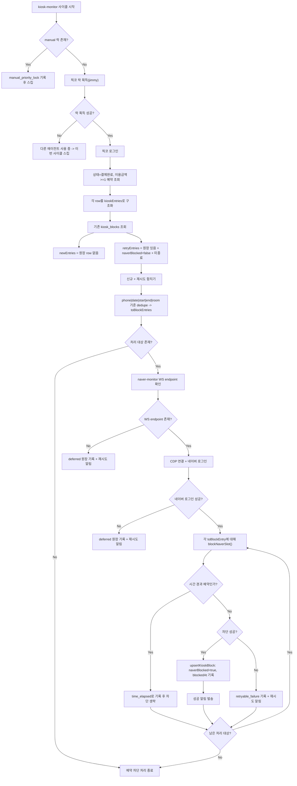

# 스카 픽코 자동 모니터링 예약 감지 절차 Runbook (2026-03-22)

## 1. 목적

이 문서는 `pickko-kiosk-monitor.ts`가 픽코 예약을 감지하고 네이버 예약불가 차단까지 수행하는 현재 절차를 운영/개발 공통 기준으로 고정한다.

현재 source of truth:
- [pickko-kiosk-monitor.ts](/Users/alexlee/projects/ai-agent-system/bots/reservation/auto/monitors/pickko-kiosk-monitor.ts)

현재 운영 원칙:
- 자동 모니터링은 `픽코 직접 감지 신규 예약 + 미차단 재시도`만 담당
- `manual/manual_retry` 후속 차단은 자동 루프에서 제외
- `manual` 픽코 작업이 진행 중이면 자동 모니터는 즉시 스킵

---

## 2. 전제 조건

- `kiosk-monitor` 실행 중
- `manual` 락이 없는 상태
- 픽코 로그인 성공
- 네이버 차단은 `naver-monitor` 브라우저 세션(CDP)에 의존

운영 의미:
- 수동 작업이 진행 중이면 자동은 멈춘다
- 사람이 개입한 예약은 `manual-block-followup` 수동 레일에서 닫는다

---

## 3. 전체 흐름도

---

## 4. 예약 감지 입력 단계

### 4-1. 픽코 예약 목록 직접 조회

픽코 예약 목록을 아래 조건으로 조회한다.

- 이용일 `>= today`
- 이용금액 `>= 1`
- 상태 = `결제완료`

의미:
- 0원 네이버 자동 등록과 구분되는 실제 키오스크/전화 예약만 읽는다
- 자동 차단 대상이 되는 예약만 가져오려는 의도

주요 필드:
- `name`
- `phoneRaw`
- `date`
- `start`
- `end`
- `room`
- `amount`

---

## 5. 예약 감지의 2개 분기

### 5-1. 신규 예약 `newEntries`

각 픽코 예약에 대해:
- `getKioskBlock(phone, date, start, end, room)` 조회

결과:
- 기존 원장 row가 없으면 `newEntries`

의미:
- 처음 보는 픽코 예약
- 아직 네이버 차단 원장 자체가 없는 상태

### 5-2. 미차단 재시도 `retryEntries`

기존 원장 row가 있는 경우 아래를 모두 만족하면 재시도 대상이다.

1. `saved.naverBlocked === false`
2. `saved.naverUnblockedAt` 없음
3. 예약 종료 시각이 지나지 않음

의미:
- 예전에 차단 시도했지만 실패
- 아직 슬롯이 살아 있어 다시 차단할 가치가 있음

중요:
- `manual/manual_retry` 후속 차단은 여기서 다루지 않는다
- 수동 예약 후속은 `manual-block-followup-report.js` / `manual-block-followup-resolve.js` 수동 레일에서만 관리한다

---

## 6. dedupe 규칙

`newEntries + retryEntries`를 합친 뒤 아래 key로 dedupe한다.

- `phone|date|start|end|room`

이유:
- 같은 사람
- 같은 날짜
- 같은 시작시각
이어도
- 종료시각 또는 룸이 다르면 다른 예약일 수 있음

운영 의미:
- 재예약/시간수정 케이스를 같은 사이클에서 잘못 합치지 않음

---

## 7. 네이버 세션 분기

### 7-1. `naver-monitor` WS endpoint 없음

동작:
- 각 예약을 `deferred`로 원장 기록
- `lastBlockReason = naver_monitor_unavailable`
- 재시도 알림 발송

의미:
- 감지는 됐지만 네이버 차단 레일이 없어 지연 상태로 남김

### 7-2. 네이버 로그인 실패

동작:
- 각 예약을 `deferred`로 원장 기록
- `lastBlockReason = naver_login_failed`
- 재시도 알림 발송

의미:
- 세션 문제를 retryable failure로 남김

---

## 8. 실제 차단 실행 절차

각 `toBlockEntry`에 대해 아래 순서로 진행한다.

### 8-1. 시간 경과 체크

아래 조건이면 차단을 생략한다.

- 예약 종료 시각이 이미 지남

동작:
- `lastBlockResult = skipped`
- `lastBlockReason = time_elapsed`
- 차단 생략 알림 발송

### 8-2. 실제 차단 시도

시간 경과가 아니면:
- `blockNaverSlot(naverPg, entry)` 호출

예외 분기:
- `detached Frame`
  - 새 탭 생성 후 1회 재시도
- 그 외 예외
  - fatal screenshot 저장
  - `exception` 처리

기본 정책:
- 최대 2회 시도
- 첫 번째는 현재 탭
- 필요 시 새 탭으로 1회 재시도

---

## 9. 성공 / 실패 분기

### 9-1. 성공

조건:
- `blockResult.ok === true`

동작:
- `upsertKioskBlock(...)`
  - `naverBlocked = true`
  - `blockedAt = nowKST()`
  - `lastBlockResult = blocked`
- 성공 알림 발송

### 9-2. 실패

조건:
- `blockResult.ok !== true`

동작:
- `upsertKioskBlock(...)`
  - `naverBlocked = false`
  - `lastBlockResult = retryable_failure`
  - `lastBlockReason = blockReason`
- `journalBlockAttempt(...)`
- 재시도 알림 발송

의미:
- 다음 사이클에 다시 후보가 될 수 있음

---

## 10. 운영 판정 포인트

### 성공 판정

- `✅ 네이버 예약 차단 완료` 알림 발생
- 해당 row가 `naverBlocked=true`
- `blockedAt` 기록

### 주의 판정

- `newEntries`는 있는데 `retryEntries`가 과도하게 누적
- `deferred`가 반복됨
- 동일 예약이 반복적으로 `retryable_failure`로 남음

### 실패 판정

- `차단 실패(...)` 재시도 알림 반복
- `naver_monitor_unavailable`
- `naver_login_failed`
- `exception`

---

## 11. 지금 당장 필요한 구조 / 나중에 확장할 구조

### 지금 당장 필요한 구조

- 자동 차단은 `픽코 직접 감지 신규 예약 + 미차단 재시도`만 담당
- `manual` 락 우선
- `manual follow-up`은 수동 운영 레일로 분리
- `phone|date|start|end|room` 기준 dedupe 유지

### 나중에 확장할 구조

- `신규 감지 수 / 재시도 수 / 차단 성공 수 / 차단 실패 수 / deferred 수` 메트릭화
- `blockReason` 분포 리포트
- SaaS 확장 시 workspace별 차단 정책 분리

---

## 12. 점검 체크리스트

운영 점검 시 아래를 같이 본다.

1. 픽코 `결제완료` 예약 목록
2. `newEntries` 건수
3. `retryEntries` 건수
4. `toBlockEntries` 건수
5. `kiosk_blocks`의 `naverBlocked / blockedAt / lastBlockResult / lastBlockReason`
6. 네이버 UI 실제 예약불가 상태
